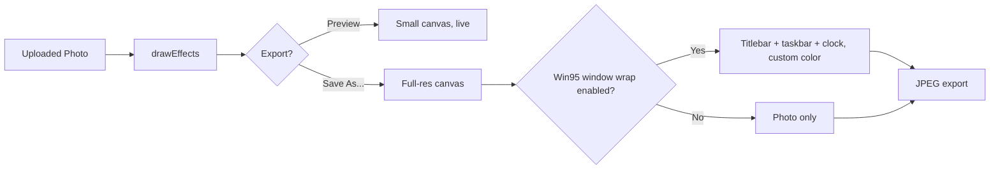

```
██╗   ██╗██████╗ ██╗  ██╗ █████╗ ███╗   ███╗
╚██╗ ██╔╝╚════██╗██║ ██╔╝██╔══██╗████╗ ████║
 ╚████╔╝  █████╔╝█████╔╝ ███████║██╔████╔██║
  ╚██╔╝  ██╔═══╝ ██╔═██╗ ██╔══██║██║╚██╔╝██║
   ██║   ███████╗██║  ██╗██║  ██║██║ ╚═╝ ██║
   ╚═╝   ╚══════╝╚═╝  ╚═╝╚═╝  ╚═╝╚═╝     ╚═╝
```

<div align="center">

### 📼 A retro digicam photo editor, styled like it's 1998

Load a photo. Slap on some grain, a light leak, a color-grade LUT, maybe a fake BSOD screen. Export it small enough to actually send.

*No server. No upload. Every pixel is processed on your device, in a &lt;canvas&gt;.*

<br>


</div>

---

## What it does

Y2Kam takes a modern phone photo and pushes it back through a decade of camera degradation on purpose — CCD grain, harsh flash glare, chromatic fringing, film light leaks, JPEG-era compression — then wraps the result in real Windows 95 window chrome, right down to a working taskbar clock.

Everything happens in one pixel pipeline, live, on a `<canvas>` element:

```
Photo → Adjustments → RGB Balance → LUT grade → Overlays & stamps → Frame (+ caption) → Win95 wrap → Export
```

No image ever leaves the browser. There's no backend, no upload endpoint, and no analytics — just three static files.

---

## Why the "Win95 window" bit isn't just a skin

A lot of retro-filter apps stop at the photo. Y2Kam treats the *chrome around* the photo as part of the aesthetic:

- The whole app UI is built as a fake OS window — titlebar, beveled buttons, a menu bar with working **File / Edit / Effects / Help** dropdowns, and every control section collapses like a real options panel
- On export, you can optionally wrap the *finished photo* in that same window chrome — complete with a live taskbar clock — so the shareable image looks like a screenshot of an old machine, not just a filtered photo
- The titlebar color is fully customizable — pick from a native color wheel or type an exact hex code, and a lighter gradient shade is derived automatically
- Four full theme palettes (Blue, Pink, Orange, Mint) reskin every border, gradient, and accent color via CSS variables



---

## The pixel pipeline

Every render — live preview *and* final export — runs through the same `drawEffects()` function in `script.js`, just at different canvas resolutions. That guarantees what you see while editing is exactly what you get on export, no surprises.

| Stage | What happens |
|---|---|
| **1. Base draw** | Source image drawn at target size; optional pixelation via a downscale/upscale trick |
| **2. Chromatic aberration** | Red and blue channels sampled with a pixel offset, green stays put — real channel-split fringing |
| **3. Tone adjustments** | Saturation, grain, fade/contrast, all applied in one pass over the `ImageData` buffer |
| **4. LUT color grade** | One of 22 hand-written channel-mix functions re-maps every pixel's RGB |
| **5. RGB Balance** | Independent Red/Green/Blue channel offsets, applied last so they fine-tune whatever the LUT produced |
| **6. Flash / light leak / vignette / scan lines** | Radial and linear gradients, `screen`-blended light leaks, scaled scan-line density |
| **7. Stamps & overlays** | Date stamps, Play/battery icons, custom text, and full-frame overlays (BSOD, VHS static, REC indicator, low battery, starfield) |
| **8. Frame** | Wraps the canvas with padding — 8 styles, from Polaroid to Ticket Stub (see below) |
| **9. Win95 window wrap** | *(optional, export-time)* Wraps everything in a full fake OS window with a customizable titlebar color and a working clock |

### Why LUTs are real math, not tint overlays

Each LUT is a small pure function — `(r, g, b) → [r, g, b]` — built from channel scaling and cross-mixing rather than a flat color overlay:

```js
coldsteel: {
  apply: (r, g, b) => {
    const gray = (r + g + b) / 3;
    return [
      clamp255(r * 0.55 + gray * 0.35),
      clamp255(g * 0.65 + gray * 0.35 + 4),
      clamp255(b * 1.15 + gray * 0.15 + 15)
    ];
  }
}
```

LUT thumbnails aren't static preview images — they're generated live from *your* loaded photo the moment it's uploaded, by running the same functions over a small cropped canvas.

### The Polaroid caption

Pick the Polaroid frame and a caption field appears, rendered in a real handwriting font (Caveat) in the bottom white strip — with a position slider to nudge it left or right, and four marker-style ink colors (black, blue, red, green) to pick from.

---

## Feature list

**Adjustments** — grain, flash glare, saturation, pixelation, fade, chromatic aberration, light leak, scan lines *(one-tap reset)*

**RGB Balance** — independent Red / Green / Blue channel offset sliders *(one-tap reset)*

**LUTs (22)** — Harbor Teal, Dust Storm, Cold Steel, Sun Fade, Night Glam, Pink Inverted, Lavender, 1997, Aden, Amaro, Mono Noir, Sepia Classic, Golden Hour, Mint Chip, Blush Film, Deep Indigo, Teal & Orange, Bleach Bypass, Kodachrome, Cyberpunk Neon, Arctic Blue, High-Key Bright — live thumbnail strip generated from your own photo

**Presets (10)** — 2003 Point-and-Shoot, Harsh Flash/Night, Low-Res Webcam, Film Leak, Dream Tape, Desert Cam, Night Glam, CRT Arcade, Pink Polaroid, Lavender Dusk

**Overlays (5)** — Fatal Error (BSOD), VHS Static/Tracking, REC Indicator, Low Battery UI, Starfield Sparkle — adjustable strength slider

**Stamps** — digicam date stamp, Play ▶ button, battery icon, custom caption text in an LCD-style font

**Frames (8)** — Polaroid *(with handwritten caption)*, Filmstrip, CRT Bezel, Tape Corners, Sticker Border, Thin Mat, Sticky Note, Ticket Stub — plus the full Win95 window wrap with custom titlebar color for export

**Themes** — Blue, Pink, Orange, Mint — swaps every UI color via CSS variables

**Interface** — every control group (Theme, Presets, Adjustments, RGB Balance, Overlay, Stamps, Frame, Export) collapses independently, so the panel stays scannable instead of one long scroll

**Export** — JPEG with a quality slider and a live estimated file-size readout, capped at 1600px on the long edge

---

## Project structure

```
y2kam/
├── index.html   → markup only
├── style.css    → all styling, incl. the 4 theme variants
├── script.js    → filters, LUTs, overlays, stamps, frames, export logic
└── README.md
```

No `package.json`, no bundler, no `node_modules`. Open `index.html` in a browser and it works.

---

## Running it locally

```bash
git clone https://github.com/<your-username>/y2kam.git
cd y2kam
# just open index.html — or, for a local dev server:
python3 -m http.server 8000
```

Then visit `http://localhost:8000`.

## Hosting on GitHub Pages

1. Push `index.html`, `style.css`, and `script.js` to your repo's root (or a `/docs` folder).
2. **Settings → Pages → Source**: deploy from a branch, pick the folder these files live in.
3. Your app is live at `https://<username>.github.io/<repo-name>/`.

---

<div align="center">

*Built with canvas &amp; nostalgia.*

</div>
